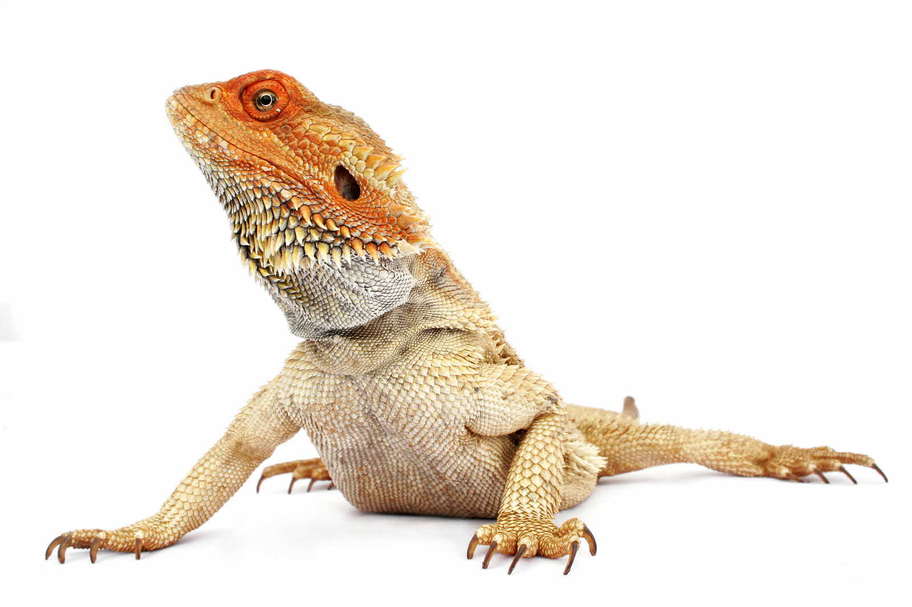

Using md and scss where new things but I found them easy to use so I didnt struggle very much. here are some lizards except the images wont load for some reason.

[lizardlink](https://en.wikipedia.org/wiki/Mexican_alligator_lizard)

&nbsp;

&nbsp;

&nbsp;

[github](https://github.com/scottdaco/scottdaco.github.io)